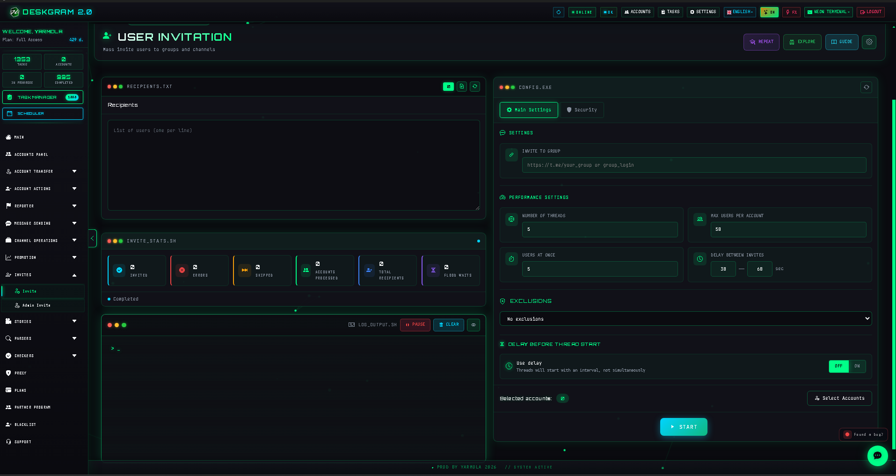
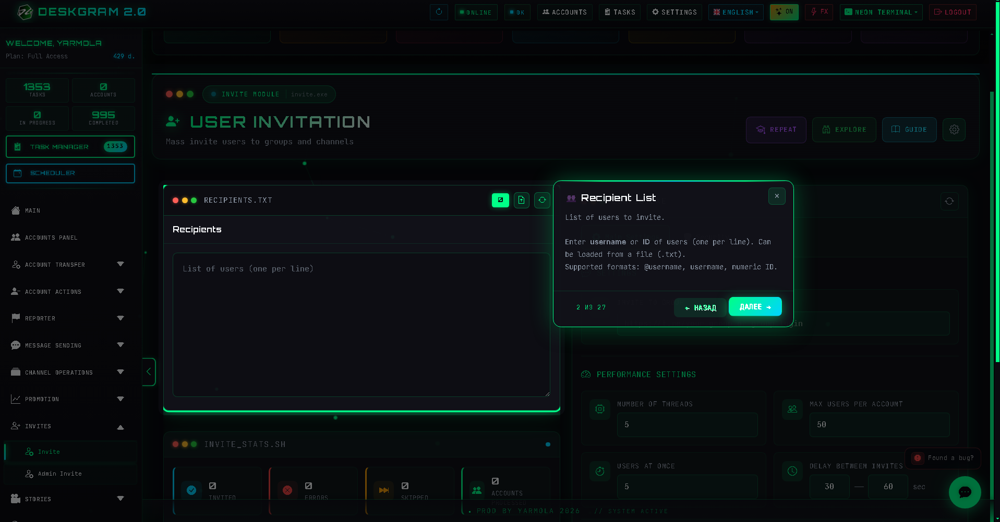
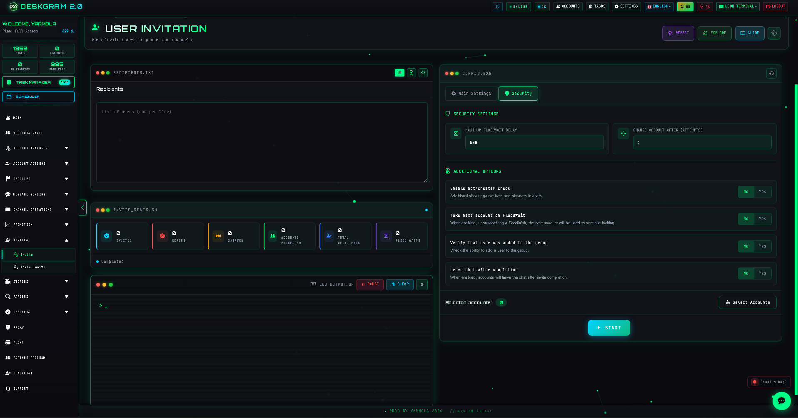

# Telegram Invite Tool with Deskgram 2

Invite is a Deskgram 2 module for mass inviting Telegram users into groups and channels. It helps scale onboarding from a prepared audience base while controlling threads, limits, flood protection, verification, and execution safety.

[Deskgram 2 Hub](https://github.com/Deskgram-2/deskgram-2-telegram-automation-en) | [Website](https://deskgram2.com/) | [Telegram Bot](https://t.me/DG2welcomebot) | [Web Preview](https://deskgram2.com/web-preview)
## Interactive Web Preview

Try the module interface in the browser: [Open web preview](https://deskgram2.com/web-preview?path=%2Fapp-demo%2Ffunctions%2Finvite)

If you want to evaluate the interface before installing anything, open the web preview first: it helps you compare the module with nearby workflows and understand the section before setup.

## About the module

| Parameter | What is inside |
|---|---|
| Main task | Mass inviting users into Telegram groups and channels |
| Audience source | Prepared recipient lists, usually after audience collection |
| Safety layer | FloodWait handling, limits, verification, account rotation |
| Useful for | Group growth, channel growth, and private community onboarding |
| Related modules | Audience Parser, Account Manager, Proxy Manager |

## What it can do

- invite users into Telegram groups and channels;
- work with public and private invite scenarios;
- distribute the load across multiple accounts;
- use exclusions and blacklist logic;
- verify whether invited users were added successfully;
- keep logs and statistics for the task.

## Quick start

1. Select the target group or channel.
2. Load the recipient base.
3. Configure threads, limits, and delays.
4. Enable verification and safety rules if needed.
5. Assign accounts and launch the task.

## What usually comes before and after invite flows

- [Audience Parser](https://github.com/Deskgram-2/telegram-audience-parser-deskgram-en), when you need to build a relevant invite base first;
- [Account Manager](https://github.com/Deskgram-2/telegram-account-manager-deskgram-en), when accounts must be grouped and prepared before launch;
- [Proxy Manager](https://github.com/Deskgram-2/telegram-proxy-manager-deskgram-en), when stable infrastructure matters under load;
- [Join Groups](https://github.com/Deskgram-2/telegram-join-groups-deskgram-en), when invite runs are part of a broader community growth chain;
- [Task Manager](https://github.com/Deskgram-2/telegram-task-manager-deskgram-en), when you want to monitor launches, failures, and overall execution progress.

## Interface highlights

### Main screen

### Recipient list

### Verification

## When it is especially useful

- when the audience base is already collected in advance;
- when invites need to be distributed across many accounts;
- when flood protection and clear statistics matter;
- when invite is the next step after audience parsing.

## Why it is more convenient than manual inviting

| Manual approach | Invite Tool in Deskgram 2 |
|---|---|
| Adding users one by one is slow | The workflow is multi-threaded |
| Flood limits are hard to track | Limits and protection are configured in advance |
| There is no central task visibility | Statistics and logs are built in |
| Exclusions are difficult to maintain | Blacklist and manual exclusions are supported |
| Scaling across many accounts is messy | The module is designed for account grids |

## Use cases

- growing a group or channel from a prepared audience base after [Audience Parser](https://github.com/Deskgram-2/telegram-audience-parser-deskgram-en);
- launching invite workflows after account preparation in [Account Manager](https://github.com/Deskgram-2/telegram-account-manager-deskgram-en) and infrastructure checks in [Proxy Manager](https://github.com/Deskgram-2/telegram-proxy-manager-deskgram-en);
- using invite as the second step in a wider community growth chain with [Join Groups](https://github.com/Deskgram-2/telegram-join-groups-deskgram-en);
- distributing large invite loads across many accounts with visibility into limits and verification.

## What to choose: Invite Tool or Direct Messaging

| If your goal is | Better fit |
|---|---|
| Bring users directly into a group or channel | `Invite Tool` |
| Start with direct outreach and conversation first | [Direct Messaging](https://github.com/Deskgram-2/telegram-direct-messaging-deskgram-en) |
| Scale community growth from a prepared audience base | `Invite Tool` |
| Build a softer pre-invite communication layer | [Direct Messaging](https://github.com/Deskgram-2/telegram-direct-messaging-deskgram-en) |

## What to choose: Invite Tool or Join Groups

| If your goal is | Better fit |
|---|---|
| Add external users into a group or channel | `Invite Tool` |
| Connect your own accounts to the target environment first | [Join Groups](https://github.com/Deskgram-2/telegram-join-groups-deskgram-en) |
| Build a two-step growth route | Join Groups first, then Invite Tool |
| Prepare the environment without touching the external audience yet | [Join Groups](https://github.com/Deskgram-2/telegram-join-groups-deskgram-en) |

## Scenario FAQ

### When is it better to warm up or join groups before launching invite?

When the account grid is new, the environment is not ready yet, or the growth route is longer than one simple action. In that case [Join Groups](https://github.com/Deskgram-2/telegram-join-groups-deskgram-en) or the broader infrastructure layer should come first.

### When does invite work better as the second step after private outreach?

When users need context before entering a community or when the audience base is still relatively cold. Then the route [Direct Messaging](https://github.com/Deskgram-2/telegram-direct-messaging-deskgram-en) -> Invite Tool often feels more natural than a direct invite jump.

### What usually determines invite quality the most?

The main factors are audience quality, account condition, limits, infrastructure stability, and whether invite is part of a logical broader route instead of an isolated action.

## Related repositories

- [Deskgram 2 Hub](https://github.com/Deskgram-2/deskgram-2-telegram-automation-en)
- [Audience Parser](https://github.com/Deskgram-2/telegram-audience-parser-deskgram-en)
- [Account Manager](https://github.com/Deskgram-2/telegram-account-manager-deskgram-en)
- [Proxy Manager](https://github.com/Deskgram-2/telegram-proxy-manager-deskgram-en)
- [Join Groups](https://github.com/Deskgram-2/telegram-join-groups-deskgram-en)
- [Task Manager](https://github.com/Deskgram-2/telegram-task-manager-deskgram-en)

## FAQ


### Can I look at the interface before installing anything?

Yes. This README already includes a direct web preview link, so you can open the module in the browser, inspect the section, and decide whether it matches your workflow before installation and account setup.

### Which recipient formats are usually used?

Typical formats are `@username`, `username`, or numeric Telegram IDs.

### What should I do about FloodWait?

Keep limits and delays conservative and use account rotation when needed.

### Where should the invite base come from?

The most natural flow is to use a base prepared by Audience Parser.
